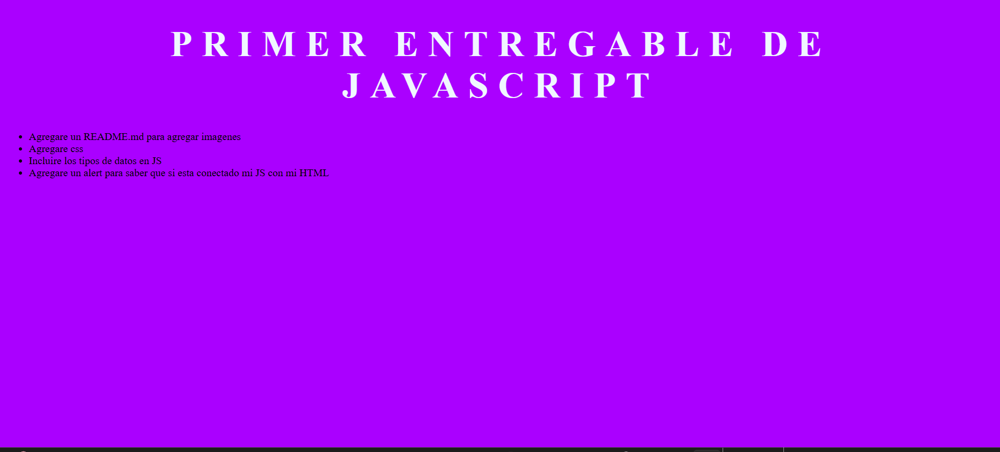
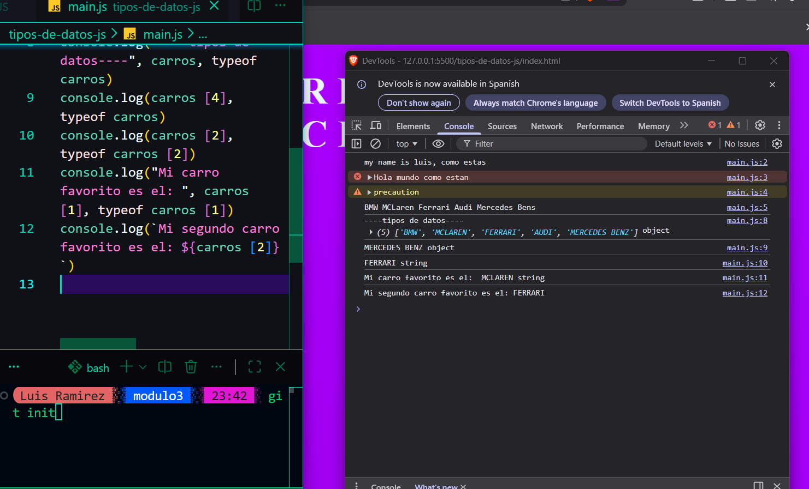
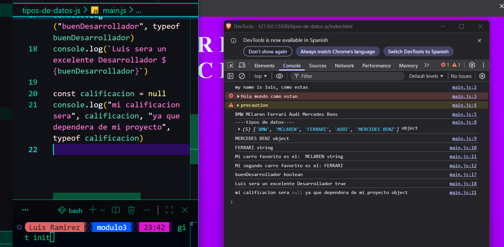

# Mi Proyecto

## Captura de pantalla

# Estoy inicializando mi proyecto.

# En este punto agrego imagen para demostrar como mando a llamar a las variables.

# Aqui sigo agregando más elementos para mi entregable
